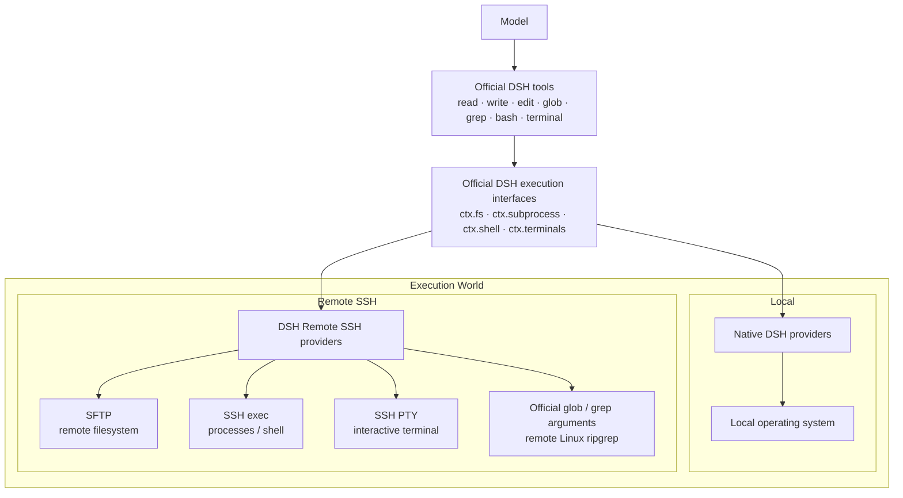

# DSH Remote SSH

[English](./README.md) | [简体中文](./README.zh-CN.md)

[](https://github.com/deepseek-ai/deepseek-harness)
[](https://github.com/zzaccount/dsh-remoteSSH/releases)
[](https://nodejs.org/)
[](./ARCHITECTURE.md)
[](./LICENSE)

Use the native **DeepSeek Harness (DSH)** tools directly on remote Linux servers.

**Every server is a group in the left workspace column.** Saving a server registers a same-named workspace for it; conversations created inside that workspace run on that server automatically, so the group holds that server's sessions. DSH's existing `read / write / edit / glob / grep / bash / terminal` tools then run remotely. The plugin does not modify DSH source code, and the server does not need DSH, this plugin, Node.js, or Python installed.


## Features

- Add, test, manage, and select SSH servers inside the DSH Web UI.
- One server becomes one group in the left workspace column; conversations inside it run on that server.
- Any folder on a server can become a **child workspace** nested under that server's group, and conversations started in it run in exactly that remote directory.
- Switch the conversation you are viewing between the local computer and saved servers at any time.
- Keep the official DSH tools instead of adding reduced `ssh_*` replacements.
- Use SFTP for files, SSH exec / Shell for commands, and SSH PTY for interactive terminals.
- The sidebar's "Workspace Files" column reads the server itself: expand remote directories, open remote files, and preview documents with paths that match the remote host (change notifications report the documented "watch unsupported", so there is no live refresh — manual refresh works).
- Preserve native `glob / grep` behavior while resolving and caching ripgrep for the remote Linux host.
- Authenticate with SSH Agent, a private-key file, or a temporary password.
- Verify SSH Host Key fingerprints on first connection and reject unexpected changes.
- Reuse connections maintained by the DSH Host instead of logging in for every message.

## Install

Requires Node.js 24 or newer, with `dsh` and `pnpm` available on `PATH`. Verified against DSH `0.2.0-rc.1` (the plugin tracks DSH's `workspace-files` contract).

```bat
dsh plugin --profile web add github:zzaccount/dsh-remoteSSH
dsh web
```

If Windows cannot find `pnpm`, run `npm install -g pnpm@11` in CMD and reopen CMD.

> Restart DSH after installing or updating the plugin: the host code is imported once at startup, and server workspaces are created at startup and when a server is saved.

## Use

### Option 1 - add a server and group by server (recommended)

1. Select **服务器工作区** (server workspaces) at the foot of the left workspace column.
2. Select **＋ 添加服务器** (add server) in the header of the servers section. With more than one server, **管理服务器** (manage servers) sits next to it for reconnect / edit / delete.
3. Enter the connection, authentication, and default working-directory settings, follow the built-in authentication guide, verify the fingerprint, then select **测试并保存** (test and save).
4. The server immediately becomes a group in the left **Workspaces** list. Select its **加为工作区** (add as workspace) to open a conversation that runs on it.
5. Conversations created inside that group run on that server automatically, with no extra switching step.

The group is named after the server; its directory is a placeholder the plugin creates locally (`<DSH profile>\remote-ssh-workspaces\<serverId>`). That directory only tells DSH where the conversations belong - files and commands stay on the server, and the default working directory still comes from the server's own setting.

### Option 1b - add a folder on a server as a child workspace

1. Select **服务器工作区** (server workspaces) at the foot of the left workspace column.
2. Find the server and select **选择目录…** (choose a directory).
3. Walk the remote directory browser into the directory you want (`..` goes up).
4. Select **把这个目录加为工作区** (add this directory as a workspace). DSH opens a conversation inside the new workspace, whose `pwd` is that remote directory.

Back in the left workspace column the directory appears **indented under its server** (the view option must be **Group by: workspace tree**). Re-adding the same remote directory never creates a second row: the plugin maps `<basename>-<hash8>` of the normalised remote path, so it reuses the existing workspace. The dialog also lists the remote directories you have added, so you can reopen one or **remove** it - removing also drops that workspace row from the left column (the local staging directory and any existing conversations are kept, and picking the same directory again brings it back).

Selecting **加为工作区** (add as workspace) on a server in the same dialog is identical to Option 1.

### Option 2 - move one existing conversation onto a server

1. Hover the conversation's row in the left workspace list and select its globe button.
2. Choose **本地电脑** (local computer) or a server. **添加服务器** (add server) is available in that same menu, too.
3. Only that one conversation changes.

Every conversation keeps its own execution location: remote rows in the left list carry a globe in their leading cell, and hovering such a row reveals the button that switches that row alone. Conversations created inside a server group follow that group's server, and an explicit choice always wins. The **服务器工作区** panel at the sidebar foot is the main entry point for adding and managing servers; that row menu also keeps its own add / manage rows, so a conversation can be pointed straight at a server that has not been saved yet.

> Note: DSH only reserves that button on conversation rows that already have messages. To run a brand-new conversation on a server, use option 1 - create it inside the server's group, where its working directory is on the server from the start.

## Screenshots

> The first two screenshots were captured on 1.0.6, when this lived under the sidebar-foot **执行位置** selector. Since 1.0.7 the entry point is the foot **服务器工作区** panel, which owns adding / editing / managing servers; moving one conversation uses the globe action on its own row. They will be re-captured.

<details>
<summary><strong>Add and configure an SSH server</strong></summary>


</details>

<details>
<summary><strong>Switch between local and remote execution environments</strong></summary>


</details>

<details>
<summary><strong>Use native DSH tools on the remote server</strong></summary>


</details>

## Architecture



```text
Native DSH @ Linux
        ≈
DSH @ local computer + DSH Remote SSH → the same Linux host
```

The plugin changes **where DSH executes**, not **how the model uses DSH tools**. See [ARCHITECTURE.md](./ARCHITECTURE.md) for implementation details.

## Authentication

| Method | Behavior |
| --- | --- |
| SSH Agent | Requests signatures without reading private-key contents or enabling Agent Forwarding; suited to personal desktops |
| Private-key file | Persists only the path and reads the file when connecting; suited to dedicated accounts or server deployments |
| Temporary password | Kept only in current DSH Host process memory and must be entered again after restart |

## Remote requirements and security boundary

- The target is a Linux / Unix host with SSH, SFTP, and a POSIX shell.
- Each server can define a default working directory; it is the initial `cwd`, not a path sandbox.
- Effective access equals the permissions of the remote SSH account.
- The Remote Provider does not expose the DSH Host's local filesystem to the remote execution world.
- Model API keys and Base URLs remain managed by DSH; this plugin does not read or store them.

See [SECURITY.md](./SECURITY.md) for details.

## Update and remove

```bat
dsh plugin --profile web update dsh-remote-ssh
dsh plugin --profile web remove dsh-remote-ssh
```

Restart DSH after updating or removing the plugin.

## Development

The sources are plain ESM JavaScript — there is no TypeScript step — and `dist/index.js` is the esbuild bundle of `src/index.js` that DSH actually loads.

```bat
git clone https://github.com/zzaccount/dsh-remoteSSH.git
cd dsh-remoteSSH
npm install
npm run check
```

`npm run check` is the single gate this repository uses: it rebuilds `dist/index.js`, runs `scripts/check-undefined.mjs` over `src`, syntax-checks every source file plus the bundle and `client.js`, and then runs the `node --test` suite. `test/` is dependency-free: every test imports only `node:*` and the plugin's own pure modules, so nothing needs a DSH installation.

```text
src/index.js                   Host entry: configuration, workspace column, server panel, wiring
src/connection-manager.js      SSH/SFTP connection pool, authentication, host-key verification
src/remote-fs.js               filesystem provider over SFTP
src/remote-subprocess.js       subprocess, shell and PTY provider
src/remote-realm.js            mounts the isolated execution world (fs, subprocess, terminal, policy, tools)
src/workspace-files-bridge.js  routes the official workspace-files Remote into a server world
src/server-workspace.js        server and remote-directory workspaces
src/store.js                   persisted server, target and workspace state
client.js                      Web UI: workspace-column rows, the server panel, dialogs
scripts/build-host.mjs         esbuild bundle to dist/index.js
scripts/check-undefined.mjs    static gate: every called name must be bound in its own module
test/                          node --test suite
```

The `@deepseek-ai/*` packages are peer dependencies supplied by DSH itself, so the tests deliberately import none of them: `test/` covers the pure modules (path translation, the workspace-files bridge, the store, the server-workspace mapping) and `scripts/check-undefined.mjs` covers the modules that only load inside DSH, where an undefined reference can otherwise ship unseen because no test can import them.

## Documentation

- [ARCHITECTURE.md](./ARCHITECTURE.md) — architecture and implementation
- [SECURITY.md](./SECURITY.md) — security model and credential handling
- [CHANGELOG.md](./CHANGELOG.md) — release history
- [CONTRIBUTING.md](./CONTRIBUTING.md) — development and contributions
- [docs/服务器工作区-交互设计.md](./docs/服务器工作区-交互设计.md) — interaction design of the server-workspace panel (Chinese)
- [docs/prototype-服务器工作区.html](./docs/prototype-服务器工作区.html) — clickable prototype of that panel, open it in a browser
- [THIRD_PARTY_NOTICES.md](./THIRD_PARTY_NOTICES.md) — third-party components bundled into the release

## Credits and upstream

This repository is a derivative work. It starts from [NaNQiQ/deepseek-harness-remote-ssh](https://github.com/NaNQiQ/deepseek-harness-remote-ssh) (MIT) and keeps that history in git, with the original copyright notice preserved in [LICENSE](./LICENSE). The work on top of it made the foot **服务器工作区** panel the single entry point for adding and managing servers (1.0.7) and added the bridge that points the sidebar's file tree at the server's own filesystem (1.0.8).

## Related project

- [DeepSeek Harness](https://github.com/deepseek-ai/deepseek-harness)

## Friends

[](https://linux.do/)

## License

[MIT](./LICENSE)
