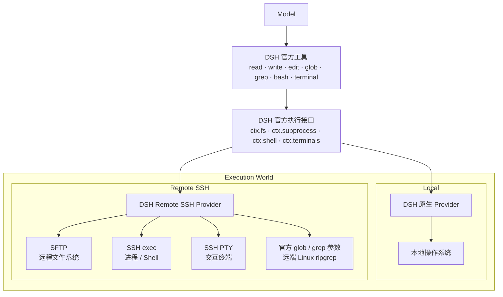

# DSH Remote SSH

[简体中文](./README.md) | [English](./README.en.md)

[](https://github.com/deepseek-ai/deepseek-harness)
[](https://github.com/zzaccount/dsh-remoteSSH/releases)
[](https://nodejs.org/)
[](./ARCHITECTURE.md)
[](./LICENSE)

让 **DeepSeek Harness（DSH）** 使用原生工具直接操作远程 Linux 服务器。

**每台服务器就是左侧工作区里的一个分组。** 保存服务器后，插件会在本地为它建立一个同名工作区；在这个工作区里新建的对话自动在这台服务器上执行，这个分组下的会话就是这台服务器的工作区会话。DSH 原有的 `read / write / edit / glob / grep / bash / terminal` 会切换到远端执行。插件不修改 DSH 源码，服务器也无需安装 DSH、本插件、Node.js 或 Python。


## 功能

- 在 DSH 页面内添加、测试、管理和选择 SSH 服务器。
- 一台服务器 = 左侧工作区里的一个分组，组内对话默认在这台服务器上执行。
- 服务器里的任意文件夹也可以加成**子工作区**（缩进显示在服务器分组下面），在这个子工作区里新建的对话直接在那个远端目录里执行。
- 也可以随时把当前对话在本地电脑与已添加的服务器之间切换：**执行位置只在这条对话行上的 🌐 菜单里显式选择时改变**（从空对话行或面板添加 / 编辑服务器都不会顺手切换对话）。
- 禁用或卸载插件时，插件建立的服务器工作区会随插件从左侧一起消失；重新启用后按服务器列表自动重建。本地占位目录保留（里面不放文件），会话记录不受影响。
- 保留 DSH 官方工具，不新增能力受限的 `ssh_*` 替代工具。
- 通过 SFTP 操作文件，通过 SSH exec / Shell 执行命令，通过 SSH PTY 提供交互终端。
- 右侧「工作区文件」列读取的就是这台服务器：可以展开远端目录、打开远端文件、预览文档，路径与远端一一对应（改动通知按 DSH 约定返回「不支持监听」，因此没有实时刷新，手动刷新照常可用）。
- 保留官方 `glob / grep`，自动处理并缓存远端 Linux 所需的 ripgrep。
- 支持 SSH Agent、私钥文件和临时密码认证。
- 首次连接核对 SSH Host Key 指纹，指纹变化时拒绝连接。
- DSH Host 维护并复用服务器连接，不会为每条消息重新登录。

## 安装

需要 Node.js 24 或更高版本，并确保 `dsh` 和 `pnpm` 可在命令行中使用。已在 DSH `0.2.0-rc.1` 上验证（插件跟随 DSH 的 `workspace-files` 契约）。

```bat
dsh plugin --profile web add github:zzaccount/dsh-remoteSSH
dsh web
```

如果 Windows 提示找不到 `pnpm`，请在 CMD 中执行 `npm install -g pnpm@11`，然后重新打开 CMD。

> 插件新增或更新后需要**重启 DSH**：Host 侧代码只在启动时加载一次，服务器工作区也是在启动/保存服务器时建立的。

## 使用

### 方式一：添加服务器并按服务器分组（推荐）

1. 点左侧工作区栏底部的 **服务器工作区**。
2. 点服务器一栏右上角的 **＋ 添加服务器**（服务器不止一台时旁边还有 **管理服务器**，可以重连 / 编辑 / 删除）。
3. 填写连接信息、认证方式和默认工作目录，按页面引导准备认证并核对服务器指纹，然后点 **测试并保存**。
4. 保存后这台服务器会立刻成为左侧工作区列表里的一个分组；点它的 **加为工作区** 打开一个对话，这个对话就在服务器上执行。
5. 在这个分组里新建的对话同样会自动在这台服务器上执行，不需要再手动切换。

分组的名字来自服务器名字；分组对应的“目录”是插件在本地建立的占位目录（`<DSH profile>\remote-ssh-workspaces\<serverId>`），它只用于让 DSH 记住归属，真正的文件和命令都在服务器上。默认工作目录仍然由服务器配置里的“默认工作目录”决定。

### 方式一之二：把服务器里的文件夹加成子工作区

1. 点左侧工作区栏底部的 **服务器工作区**。
2. 找到目标服务器，点 **选择目录…**。
3. 在远端目录浏览器里点目录逐层进入（`..` 回上级），停到你要用的那个目录。
4. 点 **把这个目录加为工作区**：DSH 会直接打开这个新工作区里的对话，`pwd` 就是这个远端目录。

回到左侧工作区列，这个目录会**缩进显示**在它所属的服务器下面（视图选项需要是「分组方式 = 工作区树」）。同一个远端目录重复添加不会产生第二条：插件按“目录名 + 路径哈希”确定性地复用已有工作区。弹窗下方还会列出**已添加的远端目录**，可以一键打开，或“移除” —— 移除会同时删掉左侧的那一行工作区（本地占位目录和已有会话都保留，重新选一次同一目录即可加回来）。

在这个入口里点某台服务器的 **加为工作区**，等于把整台服务器加成工作区（和方式一相同）。

### 方式二：把某一条已有对话切到服务器上

1. 鼠标移到左侧工作区列表里那一条对话行上，点它的切换按钮（🌐）。
2. 选择“本地电脑”或某台服务器；这台服务器上如果已经加了子工作区，也可以在同一个菜单里 **添加服务器**。
3. 切换只影响这一条对话。

每条对话各自记住自己的执行位置：左侧列表里凡是走远端的对话行，前导位置会显示一个地球标记，鼠标移到该行时还会出现那个切换按钮。分组内新建的对话以所属服务器为准，手动指定的执行位置始终优先。添加/管理服务器以页脚的「服务器工作区」面板为主要入口；会话行那个菜单里也各留了一行，方便把这条对话直接指到一台还没保存过的服务器上。

> 注意：DSH 只在**已经发过消息**的对话行上留出这个按钮的位置。刚新建、还没发过消息的对话想直接跑在服务器上，请走方式一 —— 在服务器分组里新建对话（它的工作目录从建出来就在服务器上）。

## 界面预览

> 前两张截图拍摄于 1.0.6：当时从页脚「执行位置」选择器进入。1.0.7 起入口改为页脚 **服务器工作区**，添加 / 编辑 / 管理服务器都在那一个面板里；切换某条对话则用它所在行上的 🌐 动作。截图待重新拍摄后替换。

<details>
<summary><strong>添加并配置 SSH 服务器</strong></summary>


</details>

<details>
<summary><strong>在本地与远程执行环境之间切换</strong></summary>


</details>

<details>
<summary><strong>使用 DSH 原生工具操作远程服务器</strong></summary>


</details>

## 架构



```text
原生 DSH @ Linux
        ≈
DSH @ 本地电脑 + DSH Remote SSH → 同一台 Linux
```

插件只改变 **DSH 在哪里执行**，不改变 **模型如何使用 DSH 工具**。详细实现见 [ARCHITECTURE.md](./ARCHITECTURE.md)。

## 认证

| 方式 | 说明 |
| --- | --- |
| SSH Agent | 插件只请求 Agent 签名，不读取私钥正文，也不启用 Agent Forwarding；适合个人桌面环境 |
| 私钥文件 | 只保存密钥路径，连接时读取文件；适合专用账号或服务端部署 |
| 临时密码 | 只保存在当前 DSH Host 进程内存，重启后需要重新输入 |

## 远端要求与安全边界

- 目标为提供 SSH / SFTP 和 POSIX Shell 的 Linux / Unix 主机。
- 每台服务器可设置默认工作目录；它是默认 `cwd`，不是路径沙箱。
- 实际访问能力等同于远端 SSH 账号权限。
- Remote Provider 不会向远端暴露 DSH Host 的本地文件系统。
- 模型 API Key、Base URL 等仍由 DSH 管理，本插件不读取或保存。

更多说明见 [SECURITY.md](./SECURITY.md)。

## 更新与卸载

```bat
dsh plugin --profile web update dsh-remote-ssh
dsh plugin --profile web remove dsh-remote-ssh
```

更新或卸载后重新启动 DSH。

## 开发

源码是纯 ESM JavaScript，没有 TypeScript 环节；DSH 实际加载的 `dist/index.js` 是 `src/index.js` 的 esbuild 打包产物。

```bat
git clone https://github.com/zzaccount/dsh-remoteSSH.git
cd dsh-remoteSSH
npm install
npm run check
```

`npm run check` 是本仓库唯一的验收命令：重新打包 `dist/index.js`、对 `src` 跑 `scripts/check-undefined.mjs`、对每个源码文件以及 bundle 与 `client.js` 做语法检查，最后跑 `node --test`。`test/` 不依赖任何第三方包，只 import `node:*` 与插件自身的纯模块，因此**不需要安装 DSH** 也能跑通。

```text
src/index.js                   Host 入口：配置、工作区列、服务器面板、接线
src/connection-manager.js      SSH/SFTP 连接池、认证、Host Key 校验
src/remote-fs.js               基于 SFTP 的文件系统 provider
src/remote-subprocess.js       子进程 / Shell / PTY provider
src/remote-realm.js            挂载隔离的执行世界（fs、subprocess、terminal、策略、工具）
src/workspace-files-bridge.js  把官方 workspace-files Remote 路由到某个服务器世界
src/server-workspace.js        服务器工作区与远端目录工作区
src/store.js                   持久化的服务器 / 目标 / 工作区状态
client.js                      Web UI：工作区列的行、服务器面板、各种对话框
scripts/build-host.mjs         esbuild 打包到 dist/index.js
scripts/check-undefined.mjs    静态闸门：被调用的名字必须在本模块内有绑定
test/                          node --test 测试
```

`@deepseek-ai/*` 都是由 DSH 提供的 peer 依赖，所以测试刻意不 import 它们：`test/` 覆盖纯模块（路径翻译、工作区文件桥、store、服务器工作区映射），而只在 DSH 内部才能加载的模块由 `scripts/check-undefined.mjs` 兜底 —— 否则那里一个未定义引用会因为没有任何测试能 import 它而悄悄发版。

## 文档

- [ARCHITECTURE.md](./ARCHITECTURE.md) — 架构与实现
- [SECURITY.md](./SECURITY.md) — 安全模型与凭据处理
- [CHANGELOG.md](./CHANGELOG.md) — 版本变更
- [CONTRIBUTING.md](./CONTRIBUTING.md) — 开发与贡献
- [docs/服务器工作区-交互设计.md](./docs/服务器工作区-交互设计.md) — 服务器工作区面板的交互设计
- [docs/prototype-服务器工作区.html](./docs/prototype-服务器工作区.html) — 该面板的可点击原型，用浏览器直接打开
- [THIRD_PARTY_NOTICES.md](./THIRD_PARTY_NOTICES.md) — 随发布打包的第三方组件

## 致谢与上游

本仓库是衍生作品：起点是 [NaNQiQ/deepseek-harness-remote-ssh](https://github.com/NaNQiQ/deepseek-harness-remote-ssh)（MIT），git 历史完整保留，原始版权声明保留在 [LICENSE](./LICENSE) 中。在其之上的工作把页脚 **服务器工作区** 面板做成添加与管理服务器的唯一入口（1.0.7），并新增了让右侧文件树直接读取服务器文件系统的桥接（1.0.8）。

## 相关项目

- [DeepSeek Harness](https://github.com/deepseek-ai/deepseek-harness)

## 友链

[](https://linux.do/)

## License

[MIT](./LICENSE)
